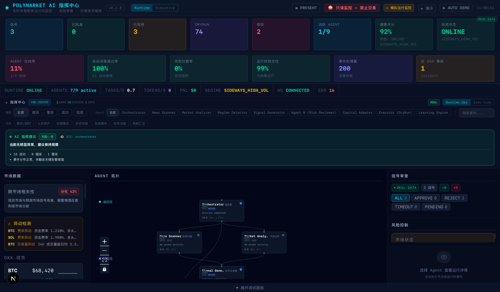
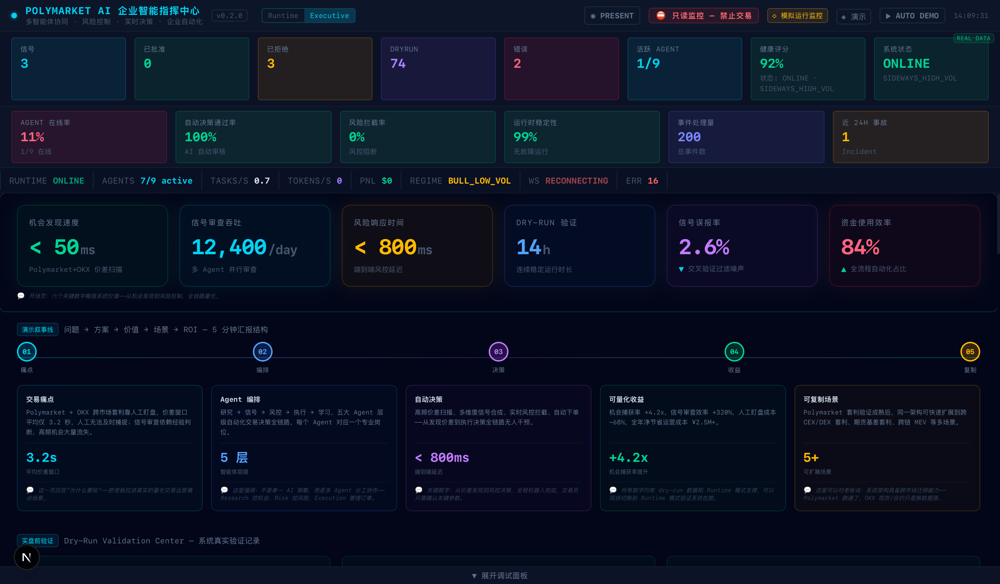
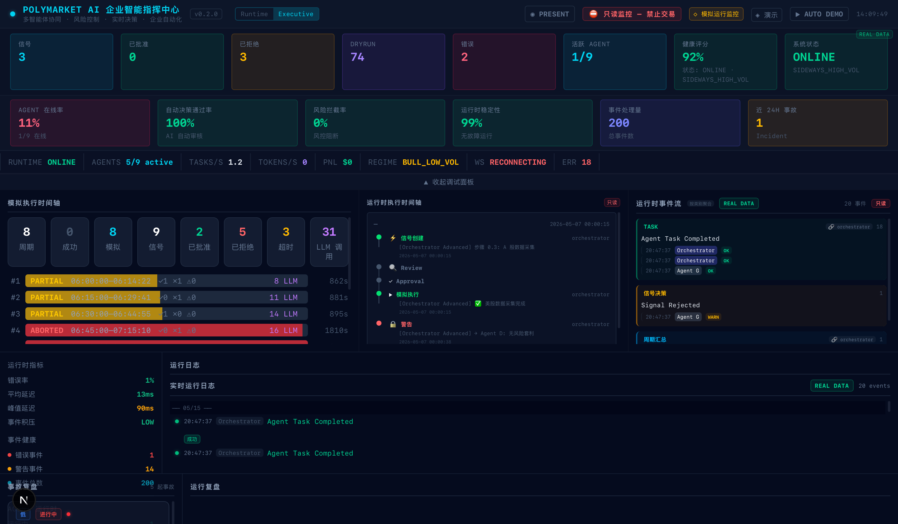

# AI Native Multi-Agent Market Runtime

A dry-run-first, non-production runtime for coordinating AI agents across market data collection, signal review, risk snapshots, simulated execution, visualization, and learning feedback.

## Screenshots

Runtime dashboard overview:



Execution runtime view:



Agent topology:



## Overview

**AI Native Multi-Agent Market Runtime** is an event-driven orchestration project for inspecting how multiple AI-assisted agents can coordinate a market workflow in dry-run mode.

The project focuses on runtime structure rather than trading claims:

- Multi-Agent Orchestration
- Runtime Observability
- Dry-Run Safety
- Risk Snapshot
- Learning Bridge
- Visualization Runtime
- Event-Driven Pipeline

It is not an automatic profit system, AI crypto trading system, live arbitrage system, high-frequency trading platform, or quant fund.

## Runtime Architecture

```text
market/reference data
        |
        v
collectors and research agents
        |
        v
signal normalization
        |
        +--------------------+
        |                    |
        v                    v
risk snapshot         learning knowledge
        |                    |
        +---------+----------+
                  |
                  v
           review gate
                  |
                  v
        dry-run execution record
                  |
                  v
          learning bridge
                  |
                  v
        runtime observability
```

The orchestrator coordinates a single runtime cycle across collection, research, signal normalization, lightweight risk context, review, dry-run execution records, learning artifacts, and monitoring outputs.

## Visualization Runtime

The runtime is designed around inspectable artifacts. Dashboards and topology views can be built from generated reports, logs, and JSON state files without requiring hidden process state.

The public screenshot paths are reserved for:

- `./docs/images/runtime-dashboard-overview.png`
- `./docs/images/runtime-exec-view.png`
- `./docs/images/runtime-topology.png`

## Key Features

- **Multi-Agent Orchestration**: discrete agents are coordinated through a central runtime cycle.
- **Event-Driven Pipeline**: stages communicate through file-based runtime artifacts.
- **Runtime Observability**: reports, logs, and state snapshots make the system inspectable.
- **Dry-Run Safety**: current validation is dry-run only and expects no real execution success.
- **Risk Snapshot**: a lightweight risk engine generates contextual runtime snapshots.
- **Learning Bridge**: post-cycle learning artifacts can feed later review context.
- **Heuristic Fallback**: degraded learning paths can refresh deterministic summaries when LLM access is unavailable.
- **Visualization Runtime**: screenshot-ready surfaces are documented for runtime overview, execution view, and topology.

## Project Structure

```text
.
├── agents/                 # Agent scripts used by the runtime and inactive experiments
├── collectors/             # Data collection modules
├── executors/              # Dry-run guarded execution record paths
├── risk/                   # Lightweight risk snapshot engine
├── scripts/                # Local validation and monitoring utilities
├── reports/                # Audit and validation reports
├── docs/images/            # Public README screenshot assets
├── orchestrator.py         # Runtime coordinator
├── main.py                 # Entry point
├── SYSTEM_ARCHITECTURE.md  # Architecture details
├── AGENT_PIPELINE.md       # Pipeline and agent status map
├── DRY_RUN_VALIDATION.md   # Dry-run validation summary
└── LIMITATIONS.md          # Safety and scope limitations
```

## Dry-Run Validation

Current validation is limited to controlled dry-run behavior:

- runtime cycle exits successfully in dry-run validation
- execution results are expected to show `success=0`
- risk snapshot generation is verified
- review cache behavior is observed
- learning artifacts refresh under fallback conditions
- monitor configuration has been restored to the short dry-run cycle profile

No real trading validation has been completed.

## Limitations

This repository is:

- **dry-run only**
- **non-production**
- **not financial advice**
- **not real trading validated**
- based on a **lightweight risk engine**
- using **heuristic fallback** for degraded learning paths
- **not an institutional quant stack**

It does not provide institutional-grade order management, portfolio construction, execution analytics, market impact modeling, capital controls, audited reconciliation, or proven trading edge.

## Safety Notice

This project is for research, runtime inspection, and dry-run validation only. It should not be used to place live trades or manage real capital.

Nothing in this repository is financial advice. The project makes no profitability claims and does not promise yield, alpha, or trading performance.

## Documentation Links

- [System Architecture](./SYSTEM_ARCHITECTURE.md)
- [Agent Pipeline](./AGENT_PIPELINE.md)
- [Dry-Run Validation](./DRY_RUN_VALIDATION.md)
- [Limitations](./LIMITATIONS.md)
- [GitHub Release Plan](./reports/github_release_plan.md)

## License / Disclaimer

No license is granted until a license file is added by the repository owner.

All content is provided for research and documentation purposes only. Use at your own risk; do not use this project for live trading without independent engineering, security, legal, financial, and operational review.
