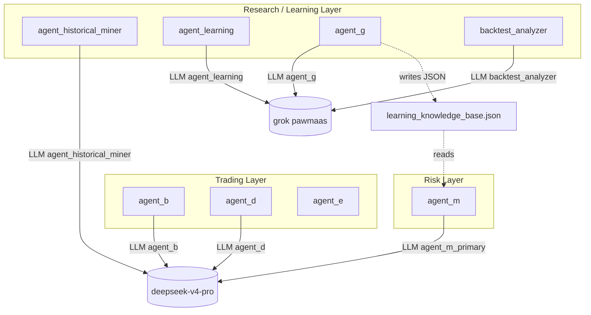

# Learning ↔ Trading Agent 依赖审计

**审计日期：** 2026-06-06  
**阶段：** P0-C — Historical Arbitrage Miner Decoupling  
**项目：** `/Users/libo/.hermes/polymarket_arbitrage`

---

## 1. 审计结论（P0-C 后）

| 类别 | 状态 |
|------|------|
| **LLM `agent_id` 借用 Trading Agent** | ✅ **已消除**（`historical_arbitrage_miner` 不再使用 `agent_d`） |
| **Research Layer 独立 identity** | ✅ `agent_historical_miner` 已注册 |
| **数据流读取（非 LLM 路由）** | ⚠️ 仍存在只读消费，见 §3 |

---

## 2. LLM 路由依赖矩阵

| Agent | Layer | LLM 调用 | `agent_id` / 模型来源 | 依赖 Trading Agent？ | 风险 |
|-------|-------|---------|----------------------|---------------------|------|
| `agent_historical_miner` | Research | `call_llm_sync` | **`agent_historical_miner`** → `deepseek-v4-pro` | ❌ 否 | 🟢 低 |
| `agent_learning` | Research | `call_llm` | `agent_learning` → grok（pawmaas provider） | ❌ 否 | 🟢 低 |
| `agent_g` | Research | `_invoke_llm` / `call_llm` | `agent_g` → grok（pawmaas provider） | ❌ 否 | 🟢 低 |
| `backtest_analyzer` | Research | `call_llm_sync` | `backtest_analyzer` → grok | ❌ 否 | 🟢 低 |
| `agent_codex` | Research/Gov | `call_llm_sync` | `agent_codex` → deepseek | ❌ 否 | 🟢 低 |
| `agent_g_distillation` | Research | `call_llm_sync` | `agent_g`（**Research→Research**） | ❌ 否 | 🟢 低 |
| `runtime/postmortem` | Research | `call_llm_sync` | `agent_g`（**Research→Research**） | ❌ 否 | 🟢 低 |
| **`agent_d`** | Trading | `call_llm_sync` | `agent_d` | — | 🔴 交易路径 |
| **`agent_b`** | Trading | `call_llm_sync` | `agent_b` | — | 🔴 交易路径 |
| **`agent_m_primary`** | Risk | `call_llm_sync` | `agent_m_primary` | — | 🔴 风控路径 |

### 2.1 P0-C 修复项（已关闭）

```
historical_arbitrage_miner
    ↓ call_llm_sync(agent_id="agent_d")   ❌ 已删除
    ↓ call_llm_sync(agent_id="agent_historical_miner")   ✅ 当前
```

---

## 3. 非 LLM 数据流依赖（信息性，非 identity 借用）

以下属于 **下游读取上游产出**，不共用 `agent_id`，但仍有架构耦合：

| 消费方 | 读取对象 | 关系 | 风险 |
|--------|---------|------|------|
| `agent_m` | `learning_knowledge_base.json`（`agent_g` 写入） | Research 洞察 → Risk prompt 增强 | 🟡 中（数据耦合，非 model 借用） |
| `strategy_manager` | `learning_knowledge_base.json` | Research → 策略配置参考 | 🟡 中 |
| `agent_b` | `learned_rules.json`（`agent_learning` 写入） | Learning → 信号生成参考 | 🟡 中 |
| `system_health_check` | 探测 `agent_b` / `agent_m` LLM | 运维探针，非 Learning 调用 | 🟢 低 |

> **原则澄清：** Learning Layer ≠ Trading Layer 在本阶段主要指 **LLM identity / provider 路由不得借用**；跨层 **JSON 知识库** 传递属产品行为，不在 P0-C 禁止范围。

---

## 4. 按 Layer 汇总



**P0-C 后：** `HM` 与 `AD` 无 LLM 边。

---

## 5. 残留风险与 P0-D 建议

| ID | 项 | 等级 | P0-D 动作 |
|----|-----|------|-----------|
| R1 | `agent_historical_miner` 仍用 `deepseek-v4-pro`（与 `agent_d` 同模型档，不同 id） | 🟢 | 可选迁移 grok（**P0-D 专题**） |
| R2 | 脚本文件名 `historical_arbitrage_miner.py` vs canonical id `agent_historical_miner` | 🟢 | 文档/registry 已对齐 |
| R3 | `agent_config` 中 timeout/retry 尚未被 `call_llm_sync` 自动读取（代码仍硬编码 180s） | 🟢 | 未来可接线，本阶段未改 timeout |

---

## 6. 扫描方法

1. 全仓库 `call_llm_sync` / `call_llm` grep  
2. 比对 `config/llm_config.json` `agent_models` / `agent_providers` / `agent_config`  
3. 检查 `agents/historical_arbitrage_miner.py` 是否仍含 `agent_d`  
4. 交叉引用 `research/`、`analytics/`、`runtime/` 学习链路

---

*P0-C 目标：Identity Decoupling — Learning LLM 路由与 Trading Agent 分离。*
